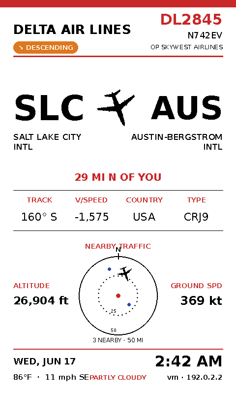
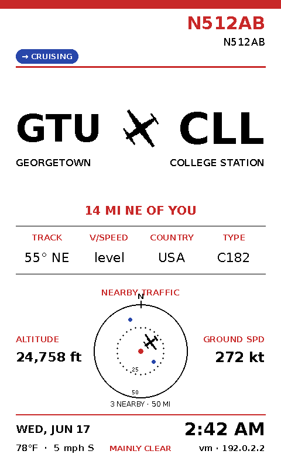
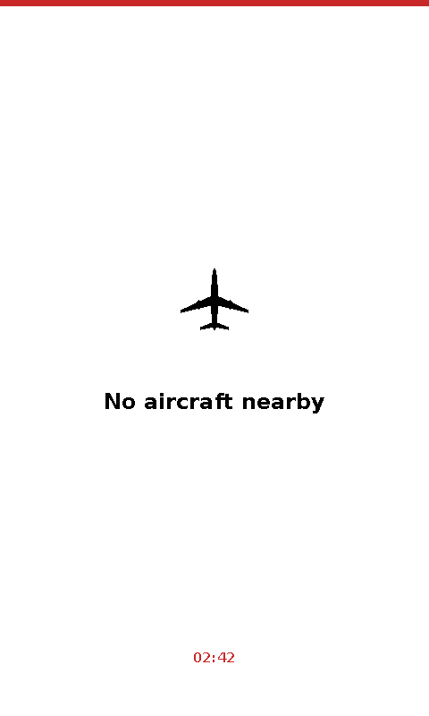

# ✈️ FlyInk Board

Welcome aboard! This is a live, overhead-flight dashboard built for the **Pimoroni Inky Impression 7.3"** colour e-paper display, piloted by a Raspberry Pi. 

Every few minutes, the radar sweeps for the closest aircraft cruising above you. It figures out where it took off, where it's touching down, draws a highly accurate, type-specific aircraft silhouette, and renders a clean, glass-cockpit-style dashboard. You get a mini radar scope, local weather conditions, and a telemetry read-out for your Pi. Fasten your seatbelts!


---

## Flight Manual (Contents)

- [Features](#features)
- [The Gallery](#gallery)
- [Hardware you'll need](#hardware-youll-need)
- [Under the Cowling (How it works)](#under-the-cowling-how-it-works)
- [Pre-flight Setup (Installation)](#pre-flight-setup-installation)
- [Flight Plan (Configuration)](#flight-plan-configuration)
- [Getting OpenSky API credentials](#getting-opensky-api-credentials)
- [Airline logos (optional)](#airline-logos-optional)
- [Cleared for Takeoff (Running it)](#cleared-for-takeoff-running-it)
- [Autopilot on boot (systemd)](#autopilot-on-boot-systemd)
- [Customizing your Avionics](#customizing-your-avionics)
- [Squawking 7700 (Troubleshooting)](#squawking-7700-troubleshooting)
- [Data sources & credits](#data-sources--credits)
- [License & disclaimer](#license--disclaimer)

---

## Features

- **Closest-aircraft dashboard** — Refreshes on its own and always locks onto the nearest aircraft, deliberately skipping the one it just showed to keep the rotation fresh.
- **Smart route resolution** — Combines live climb/descent vectors, flight-data lookups, and OpenSky flight history to show real `ORIGIN → DEST` airports. If it doesn't know, it shows a dash rather than guessing blindly in the fog.
- **Real airline, not the operator** — When a SkyWest/Envoy/Republic regional jet is flying for Delta/United/American, we show the *mainline brand* it's sold under, complete with a tiny "operated by …" footnote. Just like the departures board.
- **Commercial/GA balancing** — Air traffic control won't show you two private/GA Cessnas back-to-back if a heavy commercial flight is in range. 
- **Type-specific icons** — Distinct top-down silhouettes for jumbos, narrowbody jets, bizjets, turboprops, light GA, and helicopters—all rotated dynamically to match their live heading.
- **Mini radar** — A proper range/bearing scope with your location at the centre and local traffic plotted as blips.
- **Flight-phase pill** — Colour-coded telemetry: `CLIMBING / CRUISING / DESCENDING / ON GROUND`.
- **Auto-location** — Detects your latitude/longitude from your public IP so you don't have to manually dial in your coordinates (though you can if you want pinpoint accuracy).
- **Local weather & device footer** — Ground temperature, wind vectors, sky conditions, local time, hostname/IP, and CPU core temps.

## The Gallery

| Regional shown as mainline | General aviation | Clear skies |
| --- | --- | --- |
|  |  |  |

*(The dashboard is drawn in portrait and rotated 90° for a picture-frame mount — set `ROTATE` to match how you hang your avionics panel.)*

---

## Hardware you'll need

| Item | Notes |
| --- | --- |
| **Pimoroni Inky Impression 7.3" (800×480, 7-colour)** | The layout is calibrated specifically for this panel (model **PIM773**). |
| **Raspberry Pi with a 40-pin header** | Raspberry Pi Zero W (highly recommended for a sleek, low-power picture frame build) or a Pi 3/4/5. The Inky plugs straight on — no soldering required. |
| **microSD card** (8 GB+) | For your Raspberry Pi OS image. |
| **USB power supply** | Appropriate juice for your specific Pi model. |
| **Picture frame (optional)** | The 7.3" board is 174 × 123 mm and fits beautifully in an IKEA 180 × 130 mm frame. |

### Where to buy the display

- **Pimoroni** (manufacturer) — product guide: <https://learn.pimoroni.com/article/getting-started-with-inky-impression>
- **The Pi Hut** — <https://thepihut.com/products/inky-impression-7-3-2025-edition>
- **Pi Shop (US)** — <https://www.pishop.us/product/inky-impression-7-3-2025-edition/>
- **Pi Shop (Canada)** — <https://www.pishop.ca/product/inky-impression-7-3-2025-edition/>
- **Vilros** — <https://vilros.com/products/pimoroni-inky-impression-7-3-7-colour-epaper-e-ink-hat>

> The 4.0" (600×400) and 13.3" (1600×1200) Inky Impressions exist too, but the coordinates in this script assume the **7.3" / 800×480** panel. Other sizes will need their layout numbers recalibrated.

---

## Under the Cowling (How it works)

This script pulls telemetry from several free/public sources, acting as your personal Air Traffic Control tower:

| Source | Used for |
| --- | --- |
| [OpenSky Network](https://opensky-network.org/) | Live aircraft positions near you, and (with credentials) real departure/arrival history. |
| Flightradar24 (unofficial endpoint) | Scheduled route, airline, registration, and aircraft type. *Best-effort; see the disclaimer.* |
| [adsbdb](https://www.adsbdb.com/) | Aircraft registration/type fallback. |
| [Open-Meteo](https://open-meteo.com/) | Current weather at your location (no API key needed). |
| ipinfo.io / ipapi.co / ip-api.com | Auto-detecting your latitude/longitude from your public IP. |

---

## Pre-flight Setup (Installation)

These steps assume you're running **Raspberry Pi OS (Bookworm or later)** and that the Inky is properly seated on the Pi's 40-pin header.

**Initial Headless Setup:**
If you are using a Raspberry Pi Zero W, it is highly recommended to run it headless. Use the official **Raspberry Pi Imager** to flash *Raspberry Pi OS Lite (32-bit)*. In the Imager's advanced settings, ensure you:
- Enable SSH
- Configure your Wi-Fi credentials
- Set your local timezone

### 1. Power on the Avionics (Update and enable interfaces)

Once booted and logged in via SSH or terminal, run your pre-flight checks:

```bash
sudo apt update && sudo apt full-upgrade -y
sudo raspi-config nonint do_spi 0   # enable SPI
sudo raspi-config nonint do_i2c 0   # enable I2C
```

### 2. Install the Inky library

Pimoroni's installer sets up everything (including a Python virtual environment at `~/.virtualenvs/pimoroni`) and configures the display drivers:

```bash
git clone https://github.com/pimoroni/inky
cd inky
./install.sh
```

Reboot when it finishes:

```bash
sudo reboot
```

If you later see an error like *"some pins we need are in use … Chip Select … CS0"*, add this line to the bottom of `/boot/firmware/config.txt` and reboot:

```
dtoverlay=spi0-0cs
```

### 3. Clone the Repo and load Dependencies

```bash
git clone git@github.com:dartzonline/FlyInk-Board-.git
cd FlyInk-Board

# Use the same virtualenv the Inky installer created:
source ~/.virtualenvs/pimoroni/bin/activate
pip install -r requirements.txt
```

> **Why a virtualenv?** Recent Pi OS blocks system-wide `pip` (PEP 668). Installing into the `pimoroni` venv keeps the airspace clear of package conflicts. If you prefer a system-wide install, you can use `pip install --break-system-packages -r requirements.txt`, but the venv is highly recommended.

---

## Flight Plan (Configuration)

Open `main.py` and edit the flight parameters near the top:

```python
# Fallback location -- used only if IP geolocation goes dark.
HOME_LAT = 30.6333
HOME_LON = -97.6770
USE_IP_LOCATION = True       # auto-detect lat/lon from this device's public IP

DISPLAY_INTERVAL = 150       # seconds between screen refreshes (2.5 min)
ROTATE = 90                  # 0 / 90 / 180 / 270 to match how you mount the frame
TEMP_UNIT = "fahrenheit"     # or "celsius"
WIND_UNIT = "mph"            # "mph" / "kmh" / "ms" / "kn"
RADAR_RANGE_MI = 50          # outer ring distance on the mini radar
SEARCH_RADII = [75, 185, 435]  # miles -- widen if your skies are quiet
```

**Location:** Leave `USE_IP_LOCATION = True` to auto-detect. IP geolocation is only city/ISP-accurate, so for a fixed installation it's often better to set `USE_IP_LOCATION = False` and punch your exact `HOME_LAT` / `HOME_LON` coordinates in (grab them from any map app).

## Getting OpenSky API credentials

The tracker flies perfectly fine on Visual Flight Rules (without credentials), but the OpenSky anonymous tier is heavily rate-limited and **flight history (real origin airport) is unavailable**. For full Instrument Flight Rules (IFR) capability, add free OAuth2 credentials:

1. Create a free account at <https://opensky-network.org/>.
2. In your account settings, create an **API client** — you'll get a **client ID** and **client secret**.
3. Provide them to the script as environment variables:

```bash
export OPENSKY_CLIENT_ID="your_client_id"
export OPENSKY_CLIENT_SECRET="your_client_secret"
```

(For autostart, put these in the systemd unit — see below.)

## Airline logos (optional)

If a logo file exists, it's proudly painted on the tail (well, the header). A helper script is included to download a massive livery library automatically:

```bash
chmod +x download_logos.sh
./download_logos.sh
```

This pulls logos named by their **ICAO code** (like `DAL.png` for Delta) and places them in `~/logos`. You only need to run this script once. 

If you want to use your own custom logos, just drop transparent, square PNGs into `~/logos`. The default logo folder is `~/logos`; change `LOGO_DIR` in the script to point at the repo's `logos/` folder if you prefer (`LOGO_DIR = os.path.join(os.path.dirname(__file__), "logos")`). Simple, flat, single-colour logos dither best on e-paper.

---

## Cleared for Takeoff (Running it)

```bash
source ~/.virtualenvs/pimoroni/bin/activate
python main.py
```

The first refresh takes a moment (e-paper redraws take ~20–35 s), then it updates every `DISPLAY_INTERVAL` seconds. Watch the terminal for log lines telling you what's on the radar and which flight it has locked onto.

## Autopilot on boot (systemd)

A ready-made unit file is included as `inky-flights.service`. Edit the paths, `User`, and the OpenSky credentials inside it, then install it to engage autopilot on every boot:

```bash
# adjust paths/credentials in the file first, then:
sudo cp inky-flights.service /etc/systemd/system/inky-flights.service
sudo systemctl daemon-reload
sudo systemctl enable --now inky-flights.service

# check it:
systemctl status inky-flights.service
journalctl -u inky-flights.service -f
```

The unit waits for network connectivity, restarts on failure, and passes your OpenSky credentials via `Environment=` lines.

---

## Customizing your Avionics

Everything lives in `main.py` and is easy to tweak:

- **Nearby airports** — the `AIRPORTS` dict (ICAO → IATA, name, lat, lon) drives origin/destination inference and coordinate-based recovery. Add the fields around *your* location for better local results.
- **Mainline branding** — `MAINLINE` maps public IATA prefixes (e.g. `DL`) to the displayed airline + logo; `REGIONAL_OPERATORS` and `ICAO2IATA` help resolve those sneaky regional jets. Add carriers you see often.
- **Airline names** — extend the `AIRLINES` dict (ICAO → friendly name).
- **Refresh rate / range** — `DISPLAY_INTERVAL`, `RADAR_RANGE_MI`, `SEARCH_RADII`.
- **Aircraft icons** — proportions live in the `SHAPES` dict; classification keywords live in `classify_kind()`.

---

## Squawking 7700 (Troubleshooting)

| Symptom | Fix |
| --- | --- |
| *"Failed to detect an Inky board"* | SPI/I2C not enabled. Run the `raspi-config` commands above and reboot. |
| *"some pins we need are in use … CS0"* | Add `dtoverlay=spi0-0cs` to `/boot/firmware/config.txt` and reboot. |
| `externally-managed-environment` on `pip install` | Use the `pimoroni` virtualenv, or add `--break-system-packages`. |
| Always shows "No aircraft nearby" | Quiet skies, or no network. Widen `SEARCH_RADII`, and double check your coordinates. |
| Route shows only "DEPARTING X" a lot | Route data was incomplete for that flight; this is expected when no destination is published. Adding OpenSky credentials dramatically improves origin accuracy. |
| Wrong location | IP geolocation is approximate — set `USE_IP_LOCATION = False` and enter exact coordinates. |
| Colours look muddy | Use simpler, flat logo PNGs; e-paper has a limited palette. |
| Screen looks rotated/cut off | Set `ROTATE` (0/90/180/270) to match your physical mount. |

---

## Data sources & credits

- Aircraft positions & history: **OpenSky Network** — <https://opensky-network.org/>
- Weather: **Open-Meteo** — <https://open-meteo.com/>
- Aircraft metadata: **adsbdb** — <https://www.adsbdb.com/>
- Route/airline/type: **Flightradar24** (unofficial endpoint)
- Display hardware & library: **Pimoroni Inky** — <https://github.com/pimoroni/inky>

## License & disclaimer

Released under the **MIT License** — see `LICENSE`.

Look, this is a hobby project for staring at planes on a fancy e-ink screen. It is **absolutely not for navigation or safety-critical purposes**. If you use this to route real aircraft, you're on your own and the FAA will likely have words with you. 

Also, respect the data providers and their rate limits. We use some unofficial endpoints (like Flightradar24) to make the data richer. If they change their APIs and it breaks, the script will gracefully fall back to other sources, but don't complain if a plane shows up without an origin airport. Airline names and logos belong to their respective owners; we're just using them to make the screen look pretty.
