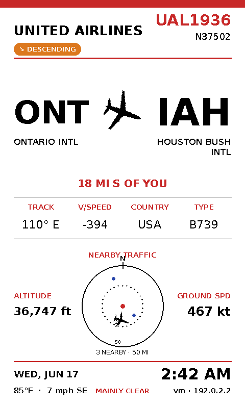

# ✈️ FlyInk Board

A live overhead-flight dashboard for the **Pimoroni Inky Impression 7.3"** colour e-paper display, piloted by a Raspberry Pi. Every few minutes it sweeps the radar for the closest aircraft cruising above you, figures out where it took off and where it's landing, draws a type-specific silhouette, and renders a clean glass-cockpit-style dashboard — mini radar scope, local weather, and Pi telemetry included.

Pin any specific flight number from your phone and the display switches to a live tracking screen with a real-time progress bar, scheduled times, and delay status. A companion web dashboard at `:8080` shows all nearby traffic — including each flight's origin → destination — and lets you control tracking or click any nearby flight to push it to the e-ink display, from any device on your network. The dashboard now shows live uptime, control-port, display-mode, and tracking state plus a `/api/health` endpoint for quick diagnostics.



---

## Flight Manual

- [Features](#features)
- [The Gallery](#the-gallery)
- [Hardware you'll need](#hardware-youll-need)
- [Under the Cowling](#under-the-cowling)
- [Pre-flight Setup](#pre-flight-setup)
- [Configuration](#configuration)
- [Raspberry Pi Quick Start](#raspberry-pi-quick-start)
- [Airline logos](#airline-logos)
- [Cleared for Takeoff](#cleared-for-takeoff)
- [Web Dashboard](#web-dashboard)
- [Flight Tracking](#flight-tracking)
- [Autopilot on boot](#autopilot-on-boot)
- [Customizing your Avionics](#customizing-your-avionics)
- [Squawking 7700](#squawking-7700)
- [Data sources & credits](#data-sources--credits)
- [License & disclaimer](#license--disclaimer)

---

## Features

- **Closest-aircraft dashboard** — Refreshes automatically and locks onto the nearest aircraft, skipping the one it just showed to keep the rotation fresh.
- **Smart route resolution** — Combines live climb/descent vectors, OpenSky flight history, and adsbdb's route database (sanity-checked against the aircraft's position so it never shows an off-corridor route) to display real `ORIGIN → DEST` airports. Shows a dash rather than guessing blindly. Priority: live motion → flight history → corridor-checked schedule.
- **Flight tracking mode** — Pin any flight number via the web UI or a direct URL. The Inky display switches to a dedicated tracking screen showing a live progress bar, scheduled departure/arrival times, revised times, and delay badges. Auto-clears 10 minutes after landing.
- **AirLabs schedule data** — Real scheduled and actual departure/arrival times plus delay information, sourced from [AirLabs](https://airlabs.co) (free API key required; degrades gracefully without one).
*(The dashboard is drawn in portrait and rotated 90° for a picture-frame mount — set `ROTATE` to match your physical setup.)*


## Hardware you'll need

| Item | Notes |
|---|---|
| **Pimoroni Inky Impression 7.3" (800×480, 7-colour)** | Layout is calibrated for this panel (model **PIM773**). |
| **Raspberry Pi with 40-pin header** | Pi Zero W is ideal for a sleek, low-power picture-frame build. Pi 3/4/5 also work. |
| **microSD card** (8 GB+) | For Raspberry Pi OS. |
| **USB power supply** | Appropriate for your Pi model. |
| **Picture frame (optional)** | The 7.3" board is 174 × 123 mm — fits an IKEA 180 × 130 mm frame beautifully. |

### Where to buy the display

- **Pimoroni** (manufacturer): <https://learn.pimoroni.com/article/getting-started-with-inky-impression>
- **The Pi Hut**: <https://thepihut.com/products/inky-impression-7-3-2025-edition>
- **Pi Shop (US)**: <https://www.pishop.us/product/inky-impression-7-3-2025-edition/>
- **Vilros**: <https://vilros.com/products/pimoroni-inky-impression-7-3-7-colour-epaper-e-ink-hat>

> The 4.0" and 13.3" Inky Impressions also exist but coordinates assume the **7.3" / 800×480** panel. Other sizes need layout recalibration.

---

## Under the Cowling

The app is split into clean modules under `src/`:

```
src/
├── config.py     — All constants and env-var driven settings
├── flights.py    — OpenSky fetch, geo math, airport data, enrichment
├── weather.py    — Open-Meteo fetch + WMO weather codes
├── tracking.py   — Pinned-flight state, AirLabs schedule fetch, track_context
├── display.py    — All Inky rendering (draw_view, draw_idle, draw_tracking)
└── web.py        — HTTP server + 3-tab dashboard + /api/state JSON endpoint
```

Data sources:

| Source | Used for |
|---|---|
| [OpenSky Network](https://opensky-network.org/) | Live aircraft positions; flight history (with credentials). |
| [AirLabs](https://airlabs.co/) | Scheduled and actual departure/arrival times, delays (free API key). |
| [adsbdb](https://www.adsbdb.com/) | Aircraft registration, type, and route lookup. |
| [Open-Meteo](https://open-meteo.com/) | Current weather at your location (no key needed). |

---

## Pre-flight Setup

These steps assume **Raspberry Pi OS (Bookworm or later)** and the Inky seated on the 40-pin header.

**Headless setup (recommended for Pi Zero W):** Use **Raspberry Pi Imager** to flash *Raspberry Pi OS Lite (32-bit)*. In advanced settings, enable SSH, configure Wi-Fi, and set your timezone.

### 1. Update and enable interfaces

```bash
sudo apt update && sudo apt full-upgrade -y
sudo raspi-config nonint do_spi 0   # enable SPI
sudo raspi-config nonint do_i2c 0   # enable I2C
```

### 2. Install the Inky library

```bash
git clone https://github.com/pimoroni/inky
cd inky
./install.sh
sudo reboot
```

If you see *"some pins we need are in use … CS0"*, add `dtoverlay=spi0-0cs` to `/boot/firmware/config.txt` and reboot.


All settings live in `src/config.py` and can be overridden with environment variables or a `.env` file:
```bash
# .env (never committed)
HOME_LAT=30.6333
HOME_LON=-97.6770
DISPLAY_INTERVAL=150       # seconds between e-ink refreshes
ROTATE=90                  # 0 / 90 / 180 / 270
TEMP_UNIT=fahrenheit       # or celsius
WIND_UNIT=mph              # mph / kmh / ms / kn
CONTROL_PORT=8080          # web dashboard port

# API credentials
OPENSKY_CLIENT_ID=...
OPENSKY_CLIENT_SECRET=...
AIRLABS_KEY=...            # free from airlabs.co
```

Set your exact `HOME_LAT` / `HOME_LON` for the best radar accuracy (grab coordinates from any map app).

---

## Getting OpenSky credentials

Without credentials the tracker still works, but the anonymous tier is rate-limited and **flight history (real origin airport)** is unavailable. For full accuracy:

1. Create a free account at <https://opensky-network.org/>.
2. In account settings, create an **API client** → get a client ID and secret.
3. Add to your `.env` file (see above) or export as environment variables.

---

## Airline logos

A helper script pulls a full livery library automatically:

```bash
chmod +x download_logos.sh
./download_logos.sh
```

This clones [Jxck-S/airline-logos](https://github.com/Jxck-S/airline-logos) and copies logos named by ICAO code (e.g. `DAL.png`) into `~/logos`. Run once. Drop custom transparent PNGs there anytime — flat, single-colour logos dither best on e-paper.

---

## Cleared for Takeoff

```bash
source ~/.virtualenvs/pimoroni/bin/activate
python main.py
```

The first refresh takes ~20–35 s (e-paper full redraw), then updates every `DISPLAY_INTERVAL` seconds. Watch the terminal for log lines.

## Raspberry Pi Quick Start

Use this when you want to run the project directly on a Raspberry Pi instead of as a boot service:

1. Enable SPI and I2C, then reboot.
2. Create or activate a Python virtualenv on the Pi.
3. Install the dependencies with `pip install -r requirements.txt`.
4. Start the app with `python main.py`.
5. Open `http://<pi-ip-address>:8080/` from your phone or laptop on the same network.

Helpful checks while it is running:

- `http://<pi-ip-address>:8080/api/state` for the current dashboard payload.
- `http://<pi-ip-address>:8080/api/health` for uptime, display mode, and tracking state.

---

## Web Dashboard

Once running, open a browser on any device on your network:

```
http://<pi-ip-address>:8080/
```

The dark-themed dashboard has three tabs:

| Tab | What you see |
|---|---|
| **Nearby Flights** | Live table of all aircraft in range — callsign, airline, type, **route (origin → destination)**, altitude, speed, distance, and colour-coded flight phase (CLIMB / CRUISE / DESC / GND). The flight currently on the Inky screen is highlighted. **Click any row** to queue that flight onto the e-ink display (shown once, then the normal closest-flight rotation resumes). |
| **Now Showing** | Card view of the flight currently displayed on the e-ink screen — full route, registration, type, altitude, speed, and bearing. |
| **Track a Flight** | Flight number input + Track/Stop buttons. Shows live tracking status, departure → arrival airports, progress bar with aircraft emoji, scheduled and revised times, and delay badge. The route airports are resolved from adsbdb even without an AirLabs key. |

The mini radar map centres on your configured `HOME_LAT` / `HOME_LON` and plots live aircraft positions around it.

The dashboard auto-refreshes every 15 seconds via the `/api/state` JSON endpoint and uses `/api/health` for its live system status cards — no page reload needed.

### Showing a specific nearby flight on the Inky

Click a row in **Nearby Flights** (or call `GET /show?flight=<callsign>`) to bump that aircraft to the front of the queue. The board draws it on the next refresh, then automatically falls back to showing the closest aircraft.

---

## Flight Tracking

To pin a specific flight:

1. Open the dashboard at `http://<pi-ip>:8080/`
2. Click the **Track a Flight** tab
3. Type any flight number — IATA (`AA1234`, `DL 456`) or ICAO (`AAL1234`) format both work
4. Hit **Track**

The Inky display immediately switches to the tracking screen showing:
- Red `✈ FLIGHT TRACKING` banner
- Live progress bar with aircraft icon positioned along the route
- Scheduled and revised departure / arrival times (from AirLabs)
- Delay badge (`+N MIN` in red, `N MIN EARLY`, or `ON TIME`)
- Calculated ETA from live groundspeed
- Full telemetry and radar in the lower panel

These times and the delay badge appear on **both** the Inky screen and the web **Track a Flight** tab. The display **auto-reverts** 10 minutes after landing, or hit **Stop** (on the web tab or `GET /stop`) to unpin immediately.

> **AirLabs is rate-limited (~1000 calls/month)**, so it is queried **only for the one flight you pin** — never for nearby traffic, which relies entirely on OpenSky + adsbdb. When you pin an ICAO callsign, the matching IATA flight number is derived from adsbdb so AirLabs can still be looked up.
>
> **No AirLabs key?** Tracking still works: origin/destination come from adsbdb, the **actual departure time** is read from OpenSky flight history, and ETA is computed from groundspeed. Only the scheduled times and the delay badge require an AirLabs key.

---

## Autopilot on boot

Create a systemd service so it starts automatically:

```bash
sudo nano /etc/systemd/system/flyink.service
```

```ini
[Unit]
Description=FlyInk Board
After=network-online.target
Wants=network-online.target

[Service]
User=pi
WorkingDirectory=/home/pi/FlyInk-Board-
ExecStart=/home/pi/.virtualenvs/pimoroni/bin/python main.py
Restart=on-failure
RestartSec=10
Environment="OPENSKY_CLIENT_ID=your_id"
Environment="OPENSKY_CLIENT_SECRET=your_secret"
Environment="AIRLABS_KEY=your_key"

[Install]
WantedBy=multi-user.target
```

```bash
sudo systemctl daemon-reload
sudo systemctl enable --now flyink.service
journalctl -u flyink.service -f   # watch the logs
```

---

## Customizing your Avionics

Everything is easy to tune in `src/config.py`:

- **Your local airports** — extend the `AIRPORTS` dict (ICAO → IATA, name, lat, lon) for better origin/destination inference around your home field.
- **Airlines** — add carriers to the `AIRLINES` and `IATA_TO_ICAO` dicts.
- **Refresh rate / radar range** — `DISPLAY_INTERVAL`, `RADAR_RANGE_KM`, `SEARCH_RADII`.
- **Aircraft icons** — proportions in the `_PARAMS` dict in `src/display.py`; classification keywords in `classify_kind()` in `src/flights.py`.
- **Display rotation** — `ROTATE` (0 / 90 / 180 / 270).

---

## Squawking 7700

| Symptom | Fix |
|---|---|
| *"Failed to detect an Inky board"* | SPI/I2C not enabled. Run `raspi-config` commands and reboot. |
| *"some pins we need are in use … CS0"* | Add `dtoverlay=spi0-0cs` to `/boot/firmware/config.txt` and reboot. |
| `externally-managed-environment` on `pip` | Use the `pimoroni` virtualenv or add `--break-system-packages`. |
| Always shows "No aircraft nearby" | Quiet skies or no network. Widen `SEARCH_RADII` and check coordinates. |
| Web dashboard shows no flights | Most often this is missing or invalid OpenSky credentials, a rate-limit, or local TLS/clock issues. Check `OPENSKY_CLIENT_ID` / `OPENSKY_CLIENT_SECRET`, confirm the Pi clock is correct, and make sure CA certificates are installed. |
| Route shows only "DEPARTING X" | Flight's destination not published yet; expected. OpenSky credentials improve origin accuracy significantly. |
| Tracked flight not found | Flight may not have departed yet (mode: AWAITING). It'll appear once airborne. |
| Scheduled times show `--` | No AirLabs key set. Add `AIRLABS_KEY` to your `.env` — free from airlabs.co. |
| Screen looks rotated / cut off | Adjust `ROTATE` (0 / 90 / 180 / 270) to match your mount. |
| Colours look muddy | Use simpler, flat, single-colour logo PNGs; e-paper palette is limited. |

---

## Data sources & credits

- Aircraft positions & history: **OpenSky Network** — <https://opensky-network.org/>
- Schedule & delay data: **AirLabs** — <https://airlabs.co/>
- Aircraft metadata & routes: **adsbdb** — <https://www.adsbdb.com/>
- Weather: **Open-Meteo** — <https://open-meteo.com/>
- Display hardware & library: **Pimoroni Inky** — <https://github.com/pimoroni/inky>
- Airline logos: **Jxck-S/airline-logos** — <https://github.com/Jxck-S/airline-logos>

---

## License & disclaimer

Released under the **MIT License** — see `LICENSE`.

This is a hobby project for staring at planes on a fancy e-ink screen. It is **not for navigation or safety-critical purposes**. Airline names and logos belong to their respective owners. Respect the data providers and their rate limits — we use free tiers and unofficial endpoints to enrich the data. If an API changes and a field goes dark, the script falls back gracefully rather than inventing information.
